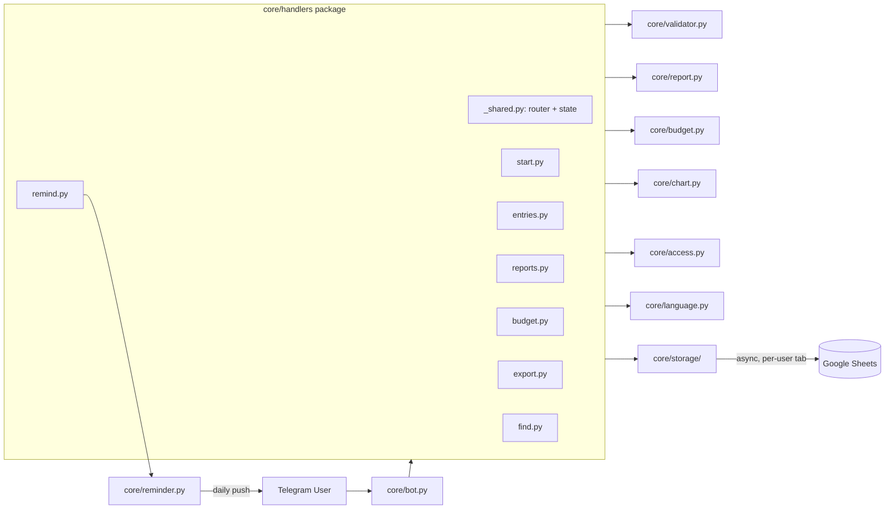

# Telegram Business & P&L Finance Tracker Bot 📊💰

A lightweight, secure Telegram Bot built with **aiogram 3.x** and **Google Sheets API**, ready for small-scale production use. It allows users to instantly log income and expenses into a remote Google Spreadsheet directly from their smartphones using clean Python regex parsing (no heavy AI overhead).

## 🏗️ Architecture



Each Telegram command lives in its own module under `core/handlers/`, all registered on one shared `aiogram.Router` from `_shared.py`. Business logic (parsing, aggregation, budgets, charts) stays in top-level `core/` modules with no Telegram dependency, so it's independently unit-tested (see [Running Tests](#-running-tests)). `core/storage/` (client setup, transactions, budgets) isolates every user's data into its own spreadsheet tab — no shared state between users beyond the bot process itself.

## ✨ Features
- 🚀 **Instant Logging:** Send messages like `150 Food` or `12000 Freelance Upwork` to automatically categorize and log entries.
- ✅ **Confirm Before Save:** Every parsed entry is shown as a preview with inline ✅/❌ buttons before it's written to the sheet.
- ✏️ **Edit Category On the Fly:** Pick from your most-used categories via quick buttons, or type a custom one, right from the confirmation preview. Category text is normalized (trimmed, whitespace-collapsed, consistently capitalized) so "cafe", "Cafe ", and " cafe" are always tracked as one category.
- ⚠️ **Duplicate Warning:** Flags a pending entry if a transaction with the same type/category/amount was saved in the last 2 minutes, to catch accidental double-sends.
- 💼 **`/budget` Command:** Set monthly spending limits per category. Plain `/budget` shows a button menu (view/add/remove) — pick a category from your most-used ones or type your own, then just type the amount. Text shortcuts still work: `/budget set Кафе 1000`, `/budget remove Кафе`. Get an over-budget warning inside `/report`.
- 📈 **Report Chart:** Every `/report` sends a horizontal bar chart image of the top spending categories alongside the text summary — skipped in favor of a short text note when there are too many categories to chart legibly.
- 📄 **`/export` Command:** Downloads every transaction as a CSV file (UTF-8 with BOM, opens correctly in Excel with Cyrillic text).
- 🔍 **`/find` Command:** Search transactions by category or description. Plain `/find` offers your most-used categories as buttons plus a free-text option; `/find кафе` searches directly. Shows a running total of matches.
- 🔔 **`/remind` Command:** Configurable reminders to log expenses — supports multiple times per day (not just one), all managed via buttons (enable/disable, add/remove a time) or text (`/remind on`, `/remind add 09:00`, `/remind remove 09:00`). Settings persist across bot restarts.
- ✨ **Multi-Entry Input:** Paste several transactions at once (one per line) and confirm/save them all together.
- ⚡ **Quick-Action Menu:** `/start` shows one-tap inline buttons for every command — kept to that one message so it doesn't clutter every reply, with no permanently-visible bottom keyboard.
- 🌐 **`/language` Command:** Switch between Ukrainian and English (persists per user across restarts). Every user-facing flow is fully bilingual, including the Telegram "/" command menu itself, which is set per-chat to match the chosen bot language rather than the Telegram client's own language.
- 🔓 **Self-Service Multi-User Access:** Anyone who presses `/start` is automatically registered — no manual ID whitelisting required. IDs listed in `ALLOWED_USER_ID` are treated as trusted admins; everyone else self-registers on first contact.
- 🔒 **Per-User Data Isolation:** Each user's transactions and budgets live in their own Google Sheet tab, created automatically on first use — no one can see or accidentally delete another user's entries.
- 📊 **`/stats` Command (admin-only):** Shows how many users are configured via `ALLOWED_USER_ID` vs. self-registered, and the running total.
- 📉 **Automated Categorization:** Automatically distinguishes between `Income` and `Expense` based on customizable keywords (Ukrainian and English).
- 📊 **Google Sheets Integration:** Non-blocking asynchronous data appending to Google Spreadsheet rows.
- 🔎 **`/last` Command:** Quickly check the most recently logged transaction without opening the spreadsheet.
- ✏️ **`/edit` Command:** Pick any of your last 10 entries (not just the most recent) from a button list, then change its amount, category, or description, or delete it — no need to open the spreadsheet for older mistakes.
- 🗑️ **`/undo` Command:** Delete the last transaction with an inline confirmation step to prevent accidental removal. If the last save was a multi-entry batch, undoes the whole batch as one unit.
- 📊 **`/report` Command:** Plain `/report` (typed or tapped from the menu) shows a two-step button picker — period first (today/week/month/2 months/year/custom), then category count (Top-5/10/15/full list/custom number) — no typing needed. Passing arguments still works directly: `/report 6` (June), `/report 6 2026`, `/report today`, `/report week`, `/report 12d` (last 12 days), `/report 2week`, `/report 2month` (calendar-accurate), `/report year`, `full`, `topN`. The chart image always matches the chosen category count.
- Windows automation setup included via batch scripting (`.bat`).

## 🛠️ Tech Stack
- **Language:** Python 3.14+
- **Framework:** Aiogram 3.x (Async Telegram Bot API)
- **Database/Storage:** Google Sheets API (`google-api-python-client`), wrapped with `asyncio.to_thread` for non-blocking calls, one tab per user
- **Environment:** Python-dotenv, RegEx

## 🚀 Quick Start for Clients
1. Share your Google Sheet with your Google Service Account email.
2. Put your `credentials.json` into the root directory.
3. Setup your `.env` file with `BOT_TOKEN`, `SPREADSHEET_ID`, and `ALLOWED_USER_ID` (see `.env.example` for the required format — the first ID listed keeps the original, non-suffixed sheet tabs).
4. Install dependencies: `pip install -r requirements.txt`
5. Run the bot using `python -m core.bot` or launch via Windows `finance_bot.bat`.

## 🧪 Running Tests
Unit tests cover the message-parsing and category-normalization logic in `core/validator.py`, monthly report aggregation in `core/report.py`, budget comparison in `core/budget.py`, chart generation in `core/chart.py`, CSV export in `core/export.py`, search filtering in `core/search.py`, reminder scheduling logic in `core/reminder.py`, translation lookup in `core/i18n.py`, and per-user language persistence in `core/language.py`:
```
pip install pytest
pytest tests/ -v
```